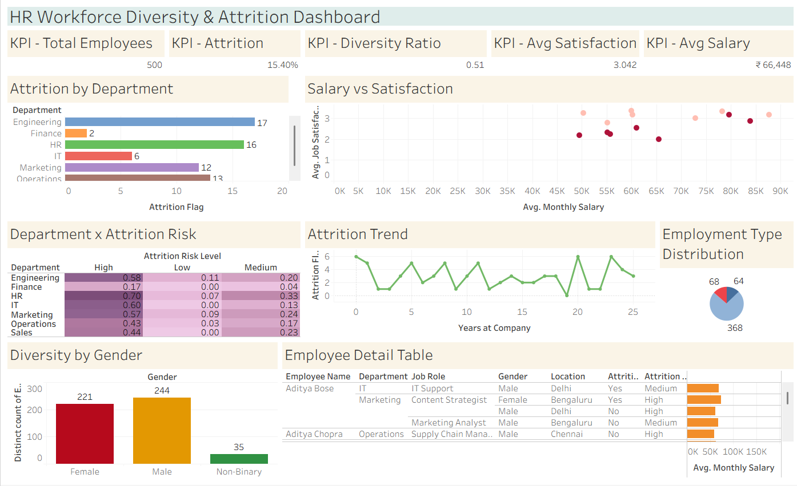

# 📊 HR Workforce Diversity & Attrition Dashboard

> **A Tableau-based People Analytics project** that empowers HR teams and business leaders to understand workforce diversity, predict attrition risk, and build data-driven retention strategies.



---

## 🎯 Objective

To design an end-to-end interactive Tableau dashboard that tracks:
- **Employee diversity** across gender, age group, and diversity category
- **Attrition patterns** by department, tenure, and risk level
- **Compensation & satisfaction** trends to identify flight risks
- **Employment type** distribution for workforce planning

The goal is to simulate a real-world People Analytics use case that HR Analysts, Business Analysts, and People Managers can use to make data-backed decisions.

---

## 🛠️ Tools & Technologies

| Tool | Purpose |
|------|---------|
| **Tableau Desktop / Tableau Public** | Dashboard design & visualization |
| **Microsoft Excel** | Dataset storage and preparation |
| **GitHub** | Project version control & portfolio hosting |

---

## 📁 Project Folder Structure

```
hr-workforce-diversity-attrition-dashboard/
│
├── 📂 data/
│   └── hr_workforce_dataset.csv          # AI-generated realistic HR dataset (500 rows)
│
├── 📂 tableau/
│   └── HR Workforce Diversity & Attrition.twbx       # Packaged Tableau workbook
│
├── 📂 screenshots/
│   ├── Chart 1.png
│   ├── Chart 2.png
│   ├── Chart 3.png
│   ├── Chart 4.png
│   └── Chart 5.png
│   └── Chart 6.png
│   └── Chart 7.png
│   └── Dashboard.png
│
└── README.md                             # Project documentation (this file)
```

---

## 📋 Dataset Description

The dataset contains **500 employee records** with **20 columns**, AI-generated to reflect realistic Indian corporate workforce demographics.

| Column | Description |
|--------|-------------|
| Employee ID | Unique identifier (EMP-1001 to EMP-1500) |
| Employee Name | Realistic Indian names |
| Age | Range: 22–60 years |
| Gender | Male / Female / Non-Binary |
| Department | Engineering, Finance, HR, IT, Marketing, Operations, Sales |
| Job Role | Role-specific titles per department |
| Location | Delhi, Mumbai, Bengaluru, Chennai, Hyderabad, Pune |
| Education Level | High School / Bachelor's / Master's / PhD |
| Years at Company | 0–25 years |
| Monthly Salary | ₹34,000 – ₹1,15,000 |
| Performance Rating | 1–5 scale |
| Job Satisfaction Score | 1–5 scale |
| Work-Life Balance Score | 1–5 scale |
| Training Hours | Hours received in last year |
| Promotion Status | Yes / No |
| Overtime Status | Yes / No |
| Employment Type | Full-Time / Part-Time / Contract |
| Diversity Category | Gender Diversity / Ethnic Diversity / Age Diversity / Disability Inclusion |
| Attrition Status | Yes / No |
| Attrition Risk Level | High / Medium / Low |

---

## 📐 Tableau Concepts Used

- **Calculated Fields** — Attrition Rate %, Diversity Ratio, Avg Satisfaction, High Risk Count
- **KPI Cards** — BAN (Big Ass Number) tiles with custom formatting
- **Heatmap** — Department × Attrition Risk Level (color-encoded intensity)
- **Scatter Plot** — Salary vs Satisfaction with gender-encoded color
- **Bar Charts** — Attrition by Department (horizontal), Diversity by Gender
- **Line Chart** — Attrition Trend over Years at Company
- **Donut Chart** — Employment Type Distribution
- **Dynamic Filters** — Department, Gender, Location, Attrition Status
- **Dashboard Actions** — Filter-on-click interactivity across all charts
- **Sets & Groups** — High-risk employee segmentation

---

## 📊 Dashboard Features

- ✅ **5 KPI Cards** — Total Employees, Attrition Rate, Diversity Ratio, Avg Satisfaction, Avg Salary
- ✅ **Attrition by Department** — Horizontal bar chart sorted by count
- ✅ **Salary vs Satisfaction Scatter Plot** — Segment employees by compensation vs happiness
- ✅ **Department × Attrition Risk Heatmap** — Identify which departments need attention
- ✅ **Attrition Trend Line** — Shows attrition across employee tenure (Years at Company)
- ✅ **Diversity by Gender Bar Chart** — Male / Female / Non-Binary headcount
- ✅ **Employment Type Donut Chart** — Full-Time vs Part-Time vs Contract split
- ✅ **Employee Detail Table** — Drillthrough with name, department, salary, risk level

---

## 🔑 Key Calculated Fields

```tableau
// Attrition Rate %
[Attrition Rate] = SUM(IF [Attrition Status] = "Yes" THEN 1 ELSE 0 END) / COUNT([Employee ID])

// Diversity Ratio
[Diversity Ratio] = COUNTD(IF [Gender] != "Male" THEN [Employee ID] END) / COUNT([Employee ID])

// High Risk Count
[High Risk Count] = SUM(IF [Attrition Risk Level] = "High" THEN 1 ELSE 0 END)

// Attrition Flag (for numeric aggregation)
[Attrition Flag] = IF [Attrition Status] = "Yes" THEN 1 ELSE 0 END
```

---

## 💡 Key Insights

### 🔴 Attrition Hotspots
- **HR department** has the highest attrition rate at **23.19%**, followed by Engineering at **20.99%**
- **Finance** is the most stable department with only **2.63%** attrition
- **77 out of 500 employees** left — overall attrition rate of **15.4%**

### ⚠️ Attrition Risk
- **63 employees** are flagged as **High Risk** — Operations leads with 14 high-risk employees
- **Operations and Sales** carry disproportionately high Medium + High risk burdens
- **Overtime is a strong attrition predictor** — employees working overtime have a **29.6% attrition rate** vs 9.2% for non-overtime

### 📉 Satisfaction vs Retention
- Employees who **left had an avg satisfaction score of 2.49** vs 3.14 for those who stayed
- Low satisfaction is the clearest leading indicator of attrition risk

### 🧑‍🤝‍🧑 Diversity
- **Male: 244 | Female: 221 | Non-Binary: 35** — moderate gender balance
- Diversity Ratio stands at **0.51**, reflecting near-equal representation
- Ethnic Diversity (101) and Gender Diversity (99) are the largest diversity categories

### 💰 Compensation
- **Engineering pays the highest** avg salary at ₹86,901/month; HR the lowest at ₹50,101
- Salary gap between genders is small but present: Male ₹67,004 vs Female ₹65,579
- Overall Average Monthly Salary: **₹66,448**

### 📋 Employment Mix
- **73.6% Full-Time | 13.6% Part-Time | 12.8% Contract**
- High contract workforce in some departments may signal workforce instability

---

## 👤 Author

**Debarati Pal**   
